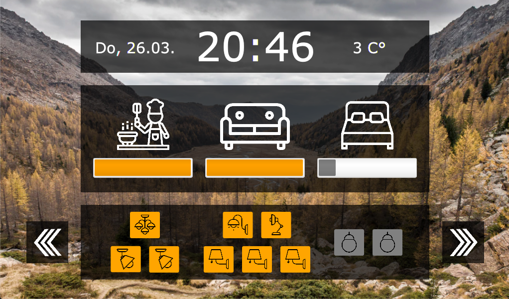
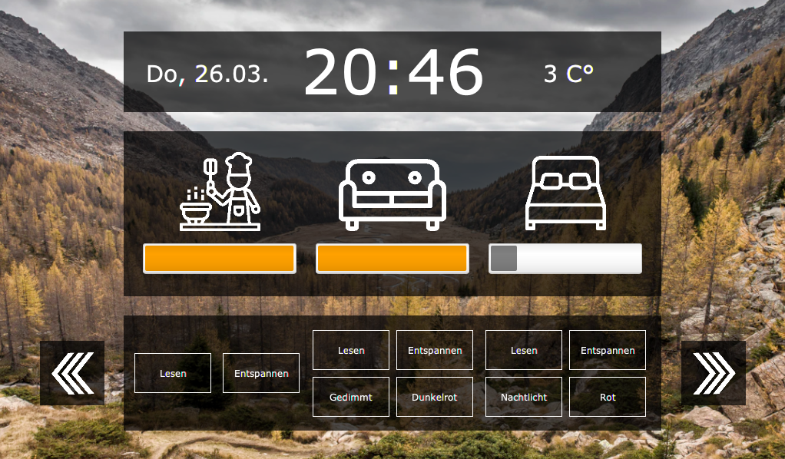

# Pi Home Screen

Raspberry Pi Home Screen

``scala - scalafx - javafx - philips hue - openWeatherMap``

Author: [Maximilian Bundscherer](https://bundscherer-online.de)

## Overview

- Control your [philips hue](https://www2.meethue.com/) light bulbs, scenes and rooms
- Show clock (time and date)
- Show weather info (data from [openWeatherMap](https://openweathermap.org/))
- Dynamic backgrounds included
- Automatic health check (network down) & active error reporting
- Jokes (personalized chuck norris jokes & trump thinks jokes)
- ISS Location Check (set alert on light bulb if iss is over your house)
- Recurring report of your light bulb states to a csv-files
- Video backgrounds (from pexels)
- Random photo backgrounds (from pexels)

### Requirements

- [Liberica JDK 13.x.x for ARM](https://bell-sw.com/pages/java-13.0.1/) - don't works with Oracle jdk (no javaFX included)
- (Optional - on target deploy) Raspberry Pi with touchscreen (1024x600 recommend)
- (Optional - ui editor for fxml files) [Scene Builder](https://gluonhq.com/products/scene-builder/) 

### Let's get started (local run for development)

- (Optional) Edit config (see section below)
- Run with ``sbt run``
- Install ``ffmpeg``
- Install ``imageMagick``

### Let's get started (run on target)

- (Optional) Edit config (see section below)
- Generate jar file with ``sbt generate-jar``
- Copy jar-file from ``./target/scala-2.12/PiHomeScreen-assembly-X.Y.jar`` to raspberry
- Run on target with ``java -jar PiHomeScreen-assembly-X.Y.jar`` (use jdk from above)
- Install ``ffmpeg``
- Install ``imageMagick``

## Config

- Edit config file under ``./src/main/resources/application.conf``
- Edit [philips hue](https://www2.meethue.com/) mapping  under ``./src/main/scala/de/maxbundscherer/pihomescreen/utils/LightConfiguration.scala``
- Add [philips hue](https://www2.meethue.com/) bridge secrets and your [openWeatherMap](https://openweathermap.org/) and joke config.